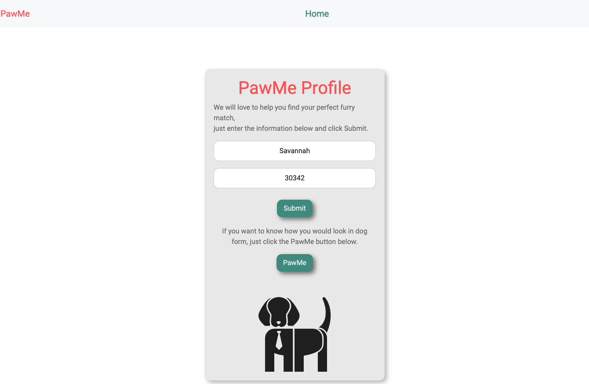
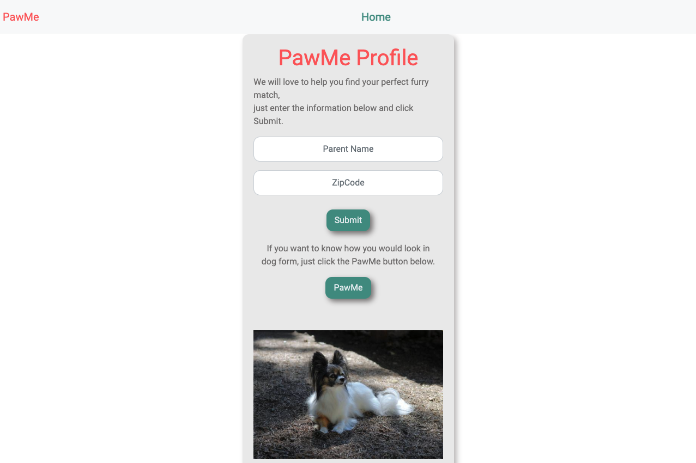
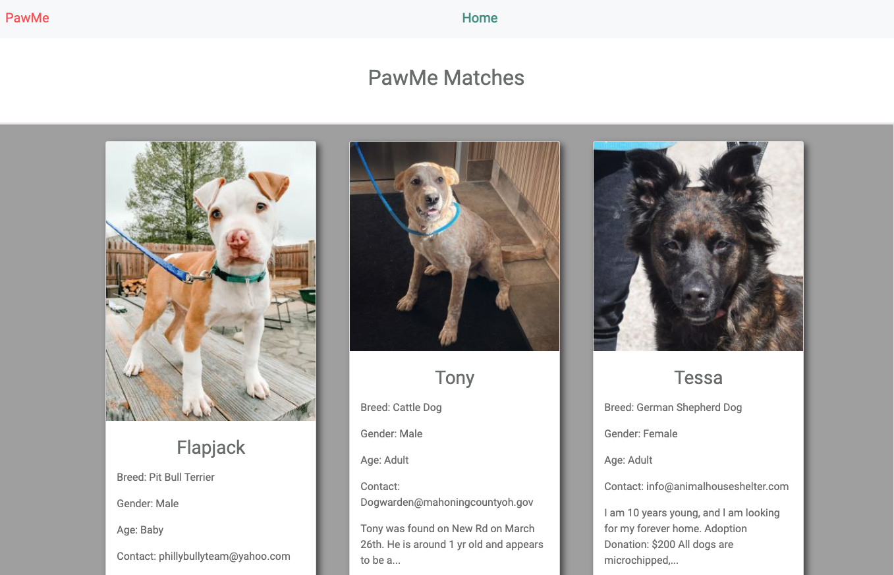

# The Omega (Pet) Project

## Description

The purpose of this project is to create a Pet Search User Interface, whereby a user can search for breeds and availability for adoption based on location.

This app uses the PetFinder API, Dog Images API, and local storage for the User to search for pet choices.

<!-- Published URL -->

https://savannahf.github.io/The_Omega_Project/

Screen Shots can be found below:

## Installation

1. Download or clone repository
2. Open the main page (index.html) on your browser to view webpage
3. Use a text editor to view all coding, Visual Studio Coding is recommended.

_or_

Visit the github-hosted webpage for the user experience!!

## Instructions

1. The user types their name into the "Parent Name" field.
2. The user types their Zip Code into the "ZipCode" field.
3. Then the user may click on the "Submit" button, which populates their PawMe results based on zip code.
4. _optional_ the user does not have to input a name or zip code in order to click on the "PawMe" button on the homepage--this button returns a random dog image on the Home page, for pet inspiration!
5. To return to the Home page after PawMe results have been generated, the user may click on the "Home" button at the top of the webpage.

## Websites

- Github: https://github.com/SavannahF/The_Omega_Project/
- Deployed: https://SavannahF.github.io/The_Omega_Project/

## Collaborators

This project was a group effort by:

- Savannah Fortson | Github : SavannahF
- Nadia Dorado | Github : ndorado3
- Paulo de Sa | Github : paulodesa
- Andrew Patison | Github: acpatison

## License

MIT

Copyright (c) [2021] [Savannah L. Fortson]

Permission is hereby granted, free of charge, to any person obtaining a copy
of this software and associated documentation files (the "Software"), to deal
in the Software without restriction, including without limitation the rights
to use, copy, modify, merge, publish, distribute, sublicense, and/or sell
copies of the Software, and to permit persons to whom the Software is
furnished to do so, subject to the following conditions:

The above copyright notice and this permission notice shall be included in all
copies or substantial portions of the Software.

THE SOFTWARE IS PROVIDED "AS IS", WITHOUT WARRANTY OF ANY KIND, EXPRESS OR
IMPLIED, INCLUDING BUT NOT LIMITED TO THE WARRANTIES OF MERCHANTABILITY,
FITNESS FOR A PARTICULAR PURPOSE AND NONINFRINGEMENT. IN NO EVENT SHALL THE
AUTHORS OR COPYRIGHT HOLDERS BE LIABLE FOR ANY CLAIM, DAMAGES OR OTHER
LIABILITY, WHETHER IN AN ACTION OF CONTRACT, TORT OR OTHERWISE, ARISING FROM,
OUT OF OR IN CONNECTION WITH THE SOFTWARE OR THE USE OR OTHER DEALINGS IN THE
SOFTWARE.
